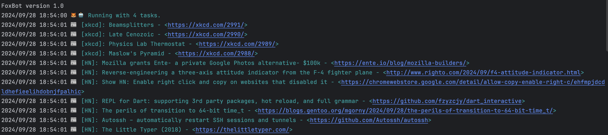
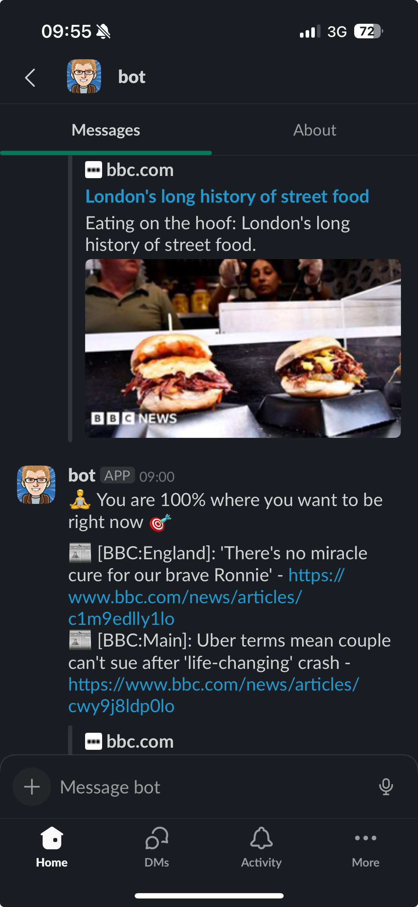

# Introducing FoxBot

If a fox was a robot it would be fantastic. This is your very own personal robot, because you are fantastic. FoxBot is your AI-free personal assistant, diligently doing your chores in the background and letting you know about things important to you.

## What Can It Do?

* Poll your RSS feeds and notify you of relvent topics
* Detect changes to websites you care about
* Daily reminders throughout the day about things to be mindful of, like drinking water
* Countdown timers

## How Do I Run It?

You can run this wherever you like. Just download the appropriate binary from [here](https://github.com/antfie/FoxBot/releases/latest).

## What Does It Look Like?

In the console you would see something like this:

However FoxBot really shines when you use it as a Slack bot:

## How Do I Configure It?

There is a [config.yaml](https://github.com/antfie/FoxBot/blob/main/config.yaml) file which will be generated on first run.

## How Can I Support This?

We welcome fixes, features and donations.

## Premium Features

If you need custom features, integrations or support we can help. Just email us at foxbot@antfie.com. We currently have the following premium feature availables:

- Monitoring share prices with buy/sell notifications

# Backlog

The following is a non-commital list of items we want to work through:

- Document how to deploy to Raspberry Pi
- Document the configuration file
- Speed test functionality, ping, ICMP
- Reduce noises and notifications at night when sleeping
- Consider daily summaries instead of regular updates
- Solar panel monitoring
- Weather
- Home automation?

# Credits

FotBot was created by Anrthony Fielding. Alert sounds by [Material Design](https://m2.material.io/design/sound/sound-resources.html) (Google), which are licenced under [CC-BY 4.0](https://creativecommons.org/licenses/by/4.0/legalcode).
