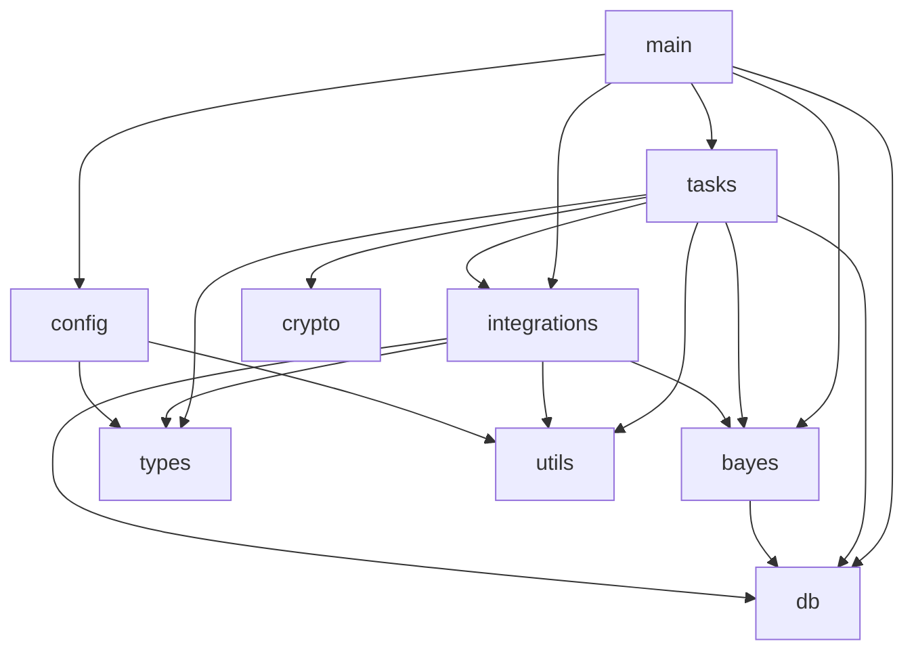

# Architecture

FoxBot is a single-binary Go service that runs scheduled tasks and delivers notifications through multiple channels.

## High-Level Overview

## Startup Sequence

## Task Scheduler

The scheduler runs a tight loop (1 tick/second), checking each registered task's next execution time. Tasks run as goroutines with `TryLock()` to prevent overlap if a previous run hasn't finished.

Each task has a configurable frequency (`hourly`, `half_hourly`, etc.) and an optional time window (`from`/`to`) that restricts execution to certain hours.

## RSS Processing

```mermaid
flowchart TD
    A[RSS Task Triggered] --> B[For each feed<br/>launch goroutine]
    B --> C[Conditional HTTP request<br/>ETag / If-Modified-Since]
    C --> C1{304 Not Modified?}
    C1 -->|yes| C2[Skip - feed unchanged]
    C1 -->|no| C3{429 Too Many Requests?}
    C3 -->|yes| C4[Back off]
    C3 -->|no| C5{Other error?}
    C5 -->|yes| C6[Increment failure counter]
    C6 --> C7{10 consecutive failures?}
    C7 -->|yes| C8[Notify: feed broken]
    C7 -->|no| C2
    C5 -->|no| D[Parse feed items]
    D --> E{For each item}
    E --> F{Old or ignored?}
    F -->|yes| E
    F -->|no| G{Already in DB?}
    G -->|yes| E
    G -->|no| H[Check title for keywords]
    H --> I{Keyword found?}
    I -->|yes| J["Notify: 📰 🚨 alert<br/>with feedback buttons"]
    I -->|no| K{HTML tags configured?}
    K -->|no| L{Bayes ready?}
    K -->|yes| M[Fetch article HTML]
    M --> N[Extract content from tags]
    N --> O{Body keyword found?}
    O -->|yes| J
    O -->|no| L
    L -->|not ready| Q["Notify: 📰 all outputs<br/>with feedback buttons"]
    L -->|ready| R{Bayes score > 0.5?}
    R -->|yes| Q
    R -->|no| P[Console only]
```

### Keyword Matching

Keywords are matched using word-boundary regex (`\b`), case-insensitive. This means `hack` matches "hack" but not "hacker" — add variants explicitly.

Three levels of keywords exist:

| Level | Scope | Matches Against |
| ----- | ----- | --------------- |
| Global `important_keywords` | Merged into all feed groups | RSS item titles |
| Group `important_keywords` | Merged with global | RSS item titles |
| HTML `important_keywords` | Group only | Article body text |

### Bayes Intelligence

When no keyword matches, the Naive Bayes classifier decides whether to notify or suppress. The classifier is trained per feed group via user feedback (👍/👎 inline buttons on Telegram notifications). Until 30 articles have been labelled for a feed group, all items are sent through for training. See [intelligence.md](intelligence.md) for full details.

### keyword_only (Slack)

When `keyword_only: true` is set on a feed group, only keyword matches are sent to Slack. Telegram still receives all items with feedback buttons for classifier training. This lets Slack users reduce noise on high-volume feeds without losing the ability to train the classifier via Telegram.

## Site Change Detection

## Notification Delivery

Messages are queued in SQLite and batched by the background processors. This means notifications are never lost if the external API is temporarily unreachable — they'll be delivered on the next successful poll.

RSS notifications to Telegram bypass the batch queue and are sent individually with inline feedback buttons.

## Package Structure

## HTTP Client

All outbound HTTP requests go through `utils.HttpRequest()` which provides:

- 30-second timeout per request
- Automatic retry with exponential backoff (5 attempts, 5s/10s/15s/20s/25s delays)
- Browser-like User-Agent header

RSS feeds additionally use conditional request headers (ETag, If-Modified-Since) to avoid re-downloading unchanged content. See [intelligence.md](intelligence.md) for details.

## Database

SQLite with a single mutex serialising all access. Migrations are embedded in the binary and run automatically on startup. The DB stores:

- Slack notification queue
- Telegram notification queue
- Seen RSS links (for deduplication, cleaned up after 30 days)
- HTTP cache (ETag, Last-Modified headers, failure counters per feed URL)
- Bayes model (word frequencies per feed group)
- Bayes article references (for feedback lookup, cleaned up after 30 days)
- Bayes stats (document counts per feed group)
- Telegram polling state (last processed update ID)
