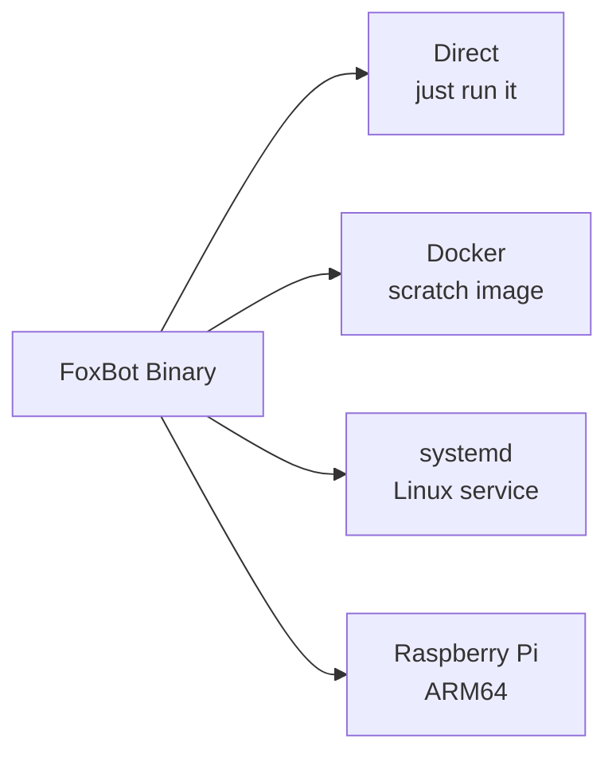

# Deployment

FoxBot is a single static binary with no runtime dependencies. Pick whichever method suits your environment.

## Quick Start

Download the latest binary for your platform from [GitHub Releases](https://github.com/antfie/FoxBot/releases/latest), then run it:

```bash
./foxbot
```

A default `config.yaml` will be created on first run. Edit it, then restart.

To use a custom config path:

```bash
./foxbot /path/to/config.yaml
```

## Deployment Options



## Docker

```bash
docker pull antfie/foxbot
docker run --rm -it -v "$(pwd):/app" antfie/foxbot
```

The container runs as a non-root user from a `scratch` base image (minimal attack surface). Mount a volume to `/app` so the config and database persist.

### Docker Compose

```yaml
services:
  foxbot:
    image: antfie/foxbot
    restart: unless-stopped
    volumes:
      - ./data:/app
```

## systemd (Linux)

1. Create a service user:

```bash
sudo useradd --system --no-create-home foxbot-service
```

2. Install the binary and config:

```bash
sudo mkdir -p /opt/FoxBot
sudo cp foxbot /opt/FoxBot/FoxBot
sudo cp config.yaml /opt/FoxBot/
sudo chown -R foxbot-service:foxbot-service /opt/FoxBot
```

3. Install the service file:

```bash
sudo cp service /etc/systemd/system/foxbot.service
sudo systemctl daemon-reload
sudo systemctl enable --now foxbot
```

4. Check status and logs:

```bash
sudo systemctl status foxbot
sudo journalctl -u foxbot -f
```

The included service file has security hardening enabled (`NoNewPrivileges`, `ProtectSystem=strict`, `ProtectHome`).

## Raspberry Pi

Cross-compile for ARM64 Linux:

```bash
GOOS=linux GOARCH=arm64 go build -ldflags="-X main.AppVersion=1.0 -s -w" -trimpath -o foxbot .
```

Then copy to your Pi and run directly or install as a systemd service (see above).

## Building from Source

```bash
git clone https://github.com/antfie/FoxBot.git
cd FoxBot

# Run tests + build all platforms
VERSION=1.0 ./scripts/build.sh

# Or build for current platform only
go build .
```

Build outputs go to `dist/`. The build script compiles for:

| Platform | Architecture | Binary |
|----------|-------------|--------|
| macOS | arm64 (Apple Silicon) | `foxbot-mac-arm64-VERSION` |
| macOS | amd64 (Intel) | `foxbot-mac-amd64-VERSION` |
| Linux | arm64 | `foxbot-linux-arm64-VERSION` |
| Linux | amd64 | `foxbot-linux-amd64-VERSION` |
| Windows | amd64 | `foxbot-VERSION.exe` |

## Data Files

FoxBot creates these files in its working directory:

| File | Purpose |
|------|---------|
| `config.yaml` | Configuration (created on first run if missing) |
| `data.db` | SQLite database (notification queues, seen RSS links, trained classifier model) |
| `data/` | Saved snapshots from site change detection |

Back up `config.yaml` and `data.db`. The database contains your trained Bayes classifier model — deleting it means the classifier will need to be retrained from scratch via Telegram feedback. You may also get duplicate RSS notifications for already-seen items.
